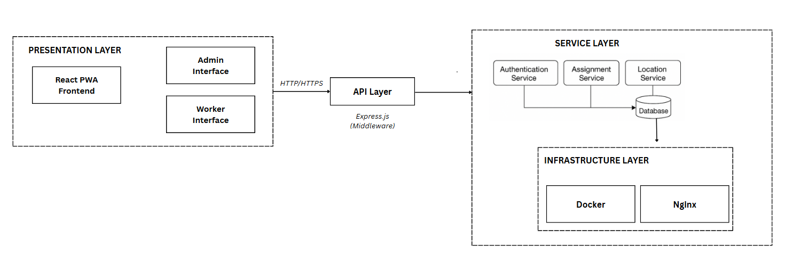

# 🛠️ Development Plan & Architecture – Geo-Location Based Attendance System Plugin

---

## 🧱 System Architecture (MERN + PWA + Docker)

---

## 🔹 Phase 1 – Build Core MERN Features

- [x] **User login** – JWT-based authentication
- [x] **Admin assigns location + schedule** – lat/lon + time range
- [x] **Counsellor/Worker fetches today’s assignment**
- [ ] **Geolocation API** – Check if user is within 100–200m radius of assigned location
- [ ] **Attendance check-in/out** – Triggered by live GPS position
- [ ] **Store entry/exit times** and compute total duration
- [ ] **Admin dashboard** to view:
  - Who checked in/out
  - Whether duration is valid

---

## 🔹 Phase 2 – Add PWA Support (Offline Attendance)

- [ ] **Service Worker + Cache API**:
  - Allow attendance marking offline
  - Sync when back online
- [ ] **Offline storage** using:
  - `IndexedDB` or `localStorage`
- [ ] **Connectivity Detection**:
  - `navigator.onLine`
  - `window.addEventListener('online', ...)` to trigger sync

---

## 🔹 Phase 3 – Dockerize the App

Once the full-stack MERN app is stable:

- [ ] Create `Dockerfile` for:
  - Backend (Node.js + MongoDB)
  - Frontend (React app)
- [ ] Use `nginx` to serve the React app
- [ ] Use `docker-compose` (optional) to run:
  - Backend
  - Frontend
  - MongoDB
- [ ] Add **PWA manifest** and deploy full stack

---

## 🔍 Technologies Used

| Layer         | Stack / Tool |
|---------------|--------------|
| Frontend      | React, Geolocation API, Service Worker, Cache API, IndexedDB |
| Backend       | Node.js, Express.js, JWT |
| Database      | MongoDB |
| Offline       | PWA: Service Workers, Cache API, `navigator.onLine` |
| Deployment    | Docker, Docker Compose, NGINX |
| Auth          | JWT-based authentication |
| Sync Handling | Online/offline detection and background syncing |

