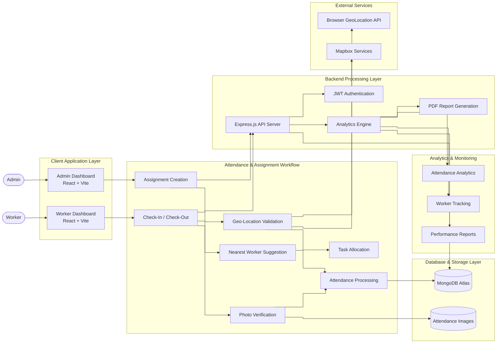

# Modular Geo Tagging System 

## Problem Statement

Organizations and NGOs that manage field workers or volunteers often face challenges in monitoring attendance and task completion accurately. Traditional attendance systems based on manual records, spreadsheets, or paper logs are inefficient and difficult to verify in real time.

Some common problems include:

- Difficulty verifying whether workers are physically present at assigned locations
- Manual attendance tracking leading to inaccurate records
- Lack of real-time visibility for administrators
- No proper proof for check-in and check-out activities
- Challenges in assigning nearby workers efficiently
- Time-consuming report generation and analytics management

These issues become more critical when managing multiple field operations across different locations.

---

# My Solution

The **Modular Geo Tagging System ** is a smart workforce attendance and assignment management platform designed to solve these challenges using geo-location validation, image verification, assignment tracking, and analytics.

The system enables administrators to:

- Create and manage field assignments
- Allocate tasks to nearby workers
- Monitor attendance records in real time
- Track worker activities and performance
- Generate analytics and attendance reports

Workers can:

- Receive assignments
- Perform secure check-in and check-out
- Verify attendance using geo-location
- Capture real-time photos for verification
- View attendance and assignment history

The system validates:
- Worker location
- Assignment timing
- Work duration
- Image capture during attendance marking

to ensure secure and reliable attendance tracking.

---

# Architecture & Features

## High-Level Workflow Architecture

```mermaid
flowchart LR

    linkStyle default interpolate stepAfter

    Worker([Worker])
    Admin([Admin])

    subgraph Client["Client Application Layer"]
        A[Worker Dashboard<br/>React + Vite]
        B[Admin Dashboard<br/>React + Vite]
    end

    Worker --> A
    Admin --> B

    subgraph Workflow["Attendance & Assignment Workflow"]
        C[Assignment Creation]
        D[Nearest Worker Suggestion]
        E[Task Allocation]
        F[Check-In / Check-Out]
        G[Geo-Location Validation]
        H[Photo Verification]
        I[Attendance Processing]
    end

    B --> C
    C --> D
    D --> E

    A --> F
    F --> G
    F --> H

    G --> I
    H --> I

    subgraph Backend["Backend Processing Layer"]
        J[Express.js API Server]
        K[JWT Authentication]
        L[Analytics Engine]
        M[PDF Report Generation]
    end

    C --> J
    F --> J

    J --> K
    J --> L
    L --> M

    subgraph Database["Database & Storage Layer"]
        N[(MongoDB Atlas)]
        O[(Attendance Images)]
    end

    I --> N
    J --> N

    H --> O

    subgraph Analytics["Analytics & Monitoring"]
        P[Attendance Analytics]
        Q[Worker Tracking]
        R[Performance Reports]
    end

    L --> P
    L --> Q
    L --> R

    subgraph External["External Services"]
        S[Browser GeoLocation API]
        T[Mapbox Services]
    end

    G --> S
    G --> T
```

---

# Core Features

## Authentication & Authorization
- Secure login and signup using JWT authentication
- Role-based access for Admin and Worker

## Geo-Location Attendance
- Real-time location validation during check-in/check-out
- Attendance allowed only within assignment location range

## Live Photo Verification
- Workers must capture live images during attendance marking
- Images stored for admin verification and analytics

## Assignment Management
- Admins can create assignments with:
  - Location
  - Date
  - Time slots
  - Duration
  - Description

## Nearest Worker Recommendation
- Workers closest to assignment location are suggested first
- Optimized task allocation based on residence location

## Attendance Analytics
- Daily attendance trends
- Worker-wise attendance records
- Success and failure tracking
- Performance insights

## PDF Report Generation
- Export attendance and analytics reports as PDF

## Worker Management
- View worker profiles
- Monitor attendance history
- Track worker activities

---

# Tech Stack Used

| Category | Technologies |
|---|---|
| Frontend | React.js, Vite, React Router DOM, Axios, Recharts, CSS3 |
| Backend | Node.js, Express.js, JWT Authentication, Multer |
| Database | MongoDB Atlas, Mongoose ODM |
| External APIs | Browser GeoLocation API, Mapbox API |
| Deployment | Vercel, Render |
| Version Control | Git, GitHub |
